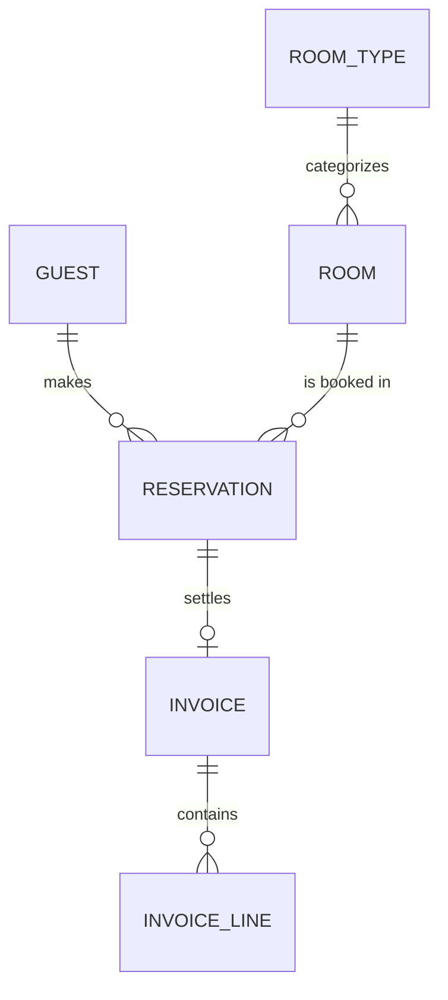

# Entity Model

## Entity Relationship Diagram

### GUEST

A person who books rooms or stays at the hotel.

| Attribute    | Description                          | Data Type | Length/Precision | Validation Rules        |
|--------------|--------------------------------------|-----------|------------------|-------------------------|
| id           | Unique identifier                    | Long      | 19               | Primary Key, Sequence   |
| first_name   | Given name of the guest              | String    | 100              | Not Null                |
| last_name    | Family name of the guest             | String    | 100              | Not Null                |
| email        | Email address used for confirmations | String    | 200              | Not Null, Format: Email |
| phone        | Contact phone number                 | String    | 30               | Optional                |
| address      | Postal address                       | String    | 300              | Optional                |
| date_of_birth | Date of birth                       | Date      | -                | Optional                |
| created_at   | Timestamp the guest record was created | DateTime | -               | Not Null                |

### ROOM_TYPE

Defines categories of rooms with shared capacity and pricing.

| Attribute   | Description                       | Data Type | Length/Precision | Validation Rules          |
|-------------|-----------------------------------|-----------|------------------|---------------------------|
| id          | Unique identifier                 | Long      | 19               | Primary Key, Sequence     |
| name        | Name of the room type             | String    | 50               | Not Null, Unique          |
| description | Detailed description              | String    | 500              | Optional                  |
| capacity    | Maximum number of guests          | Integer   | 10               | Not Null, Min: 1, Max: 10 |
| price       | Price per night in CHF            | Decimal   | 10,2             | Not Null, Min: 0          |

### ROOM

A physical room in the hotel that can be booked and occupied.

| Attribute    | Description                                  | Data Type | Length/Precision | Validation Rules                                                                |
|--------------|----------------------------------------------|-----------|------------------|---------------------------------------------------------------------------------|
| id           | Unique identifier                            | Long      | 19               | Primary Key, Sequence                                                           |
| number       | Room number displayed to staff and guests    | String    | 10               | Not Null, Unique                                                                |
| floor        | Floor where the room is located              | Integer   | 10               | Not Null, Min: 0                                                                |
| room_type_id | Room type that this room belongs to          | Long      | 19               | Not Null, Foreign Key (ROOM_TYPE.id)                                            |
| status       | Current operational status of the room       | String    | 20               | Not Null, Values: AVAILABLE, OCCUPIED, CLEANING, MAINTENANCE                    |
| notes        | Internal notes about the room                | String    | 500              | Optional                                                                        |

### RESERVATION

A booking of one room by one guest for a date range.

| Attribute      | Description                                       | Data Type | Length/Precision | Validation Rules                                                              |
|----------------|---------------------------------------------------|-----------|------------------|-------------------------------------------------------------------------------|
| id             | Unique identifier                                 | Long      | 19               | Primary Key, Sequence                                                         |
| confirmation_code | Public code shared with the guest              | String    | 20               | Not Null, Unique                                                              |
| guest_id       | Guest who holds the reservation                   | Long      | 19               | Not Null, Foreign Key (GUEST.id)                                              |
| room_id        | Room assigned to the reservation                  | Long      | 19               | Not Null, Foreign Key (ROOM.id)                                               |
| check_in_date  | First night of the stay                           | Date      | -                | Not Null                                                                      |
| check_out_date | Departure date (not included in nights)           | Date      | -                | Not Null                                                                      |
| number_of_guests | Number of guests covered by the reservation     | Integer   | 10               | Not Null, Min: 1, Max: 10                                                     |
| status         | Lifecycle state of the reservation                | String    | 20               | Not Null, Values: CONFIRMED, CHECKED_IN, CHECKED_OUT, CANCELLED               |
| total_price    | Total price for the stay in CHF                   | Decimal   | 10,2             | Not Null, Min: 0                                                              |
| created_at     | Timestamp the reservation was created             | DateTime  | -                | Not Null                                                                      |
| cancelled_at   | Timestamp the reservation was cancelled, if any   | DateTime  | -                | Optional                                                                      |

**Constraints:** check_out_date must be strictly after check_in_date. A room must not have two non-cancelled reservations whose date ranges overlap. number_of_guests must not exceed the capacity of the assigned room's room type.

### INVOICE

The bill issued to a guest at check-out for a reservation.

| Attribute       | Description                              | Data Type | Length/Precision | Validation Rules                                       |
|-----------------|------------------------------------------|-----------|------------------|--------------------------------------------------------|
| id              | Unique identifier                        | Long      | 19               | Primary Key, Sequence                                  |
| invoice_number  | Human-readable invoice number            | String    | 30               | Not Null, Unique                                       |
| reservation_id  | Reservation being settled by the invoice | Long      | 19               | Not Null, Unique, Foreign Key (RESERVATION.id)         |
| issued_at       | Timestamp the invoice was issued         | DateTime  | -                | Not Null                                               |
| total_amount    | Total amount due in CHF                  | Decimal   | 10,2             | Not Null, Min: 0                                       |
| status          | Payment state of the invoice             | String    | 20               | Not Null, Values: OPEN, PAID, CANCELLED                |
| paid_at         | Timestamp the invoice was paid           | DateTime  | -                | Optional                                               |

### INVOICE_LINE

A single charge line on an invoice, such as a night's stay or an extra service.

| Attribute   | Description                         | Data Type | Length/Precision | Validation Rules                       |
|-------------|-------------------------------------|-----------|------------------|----------------------------------------|
| id          | Unique identifier                   | Long      | 19               | Primary Key, Sequence                  |
| invoice_id  | Invoice this line belongs to        | Long      | 19               | Not Null, Foreign Key (INVOICE.id)     |
| description | Description of the charge           | String    | 200              | Not Null                               |
| quantity    | Quantity of the item charged        | Integer   | 10               | Not Null, Min: 1                       |
| unit_price  | Price per unit in CHF               | Decimal   | 10,2             | Not Null, Min: 0                       |
| line_total  | Total for this line in CHF          | Decimal   | 10,2             | Not Null, Min: 0                       |

**Constraints:** line_total must equal quantity multiplied by unit_price.
