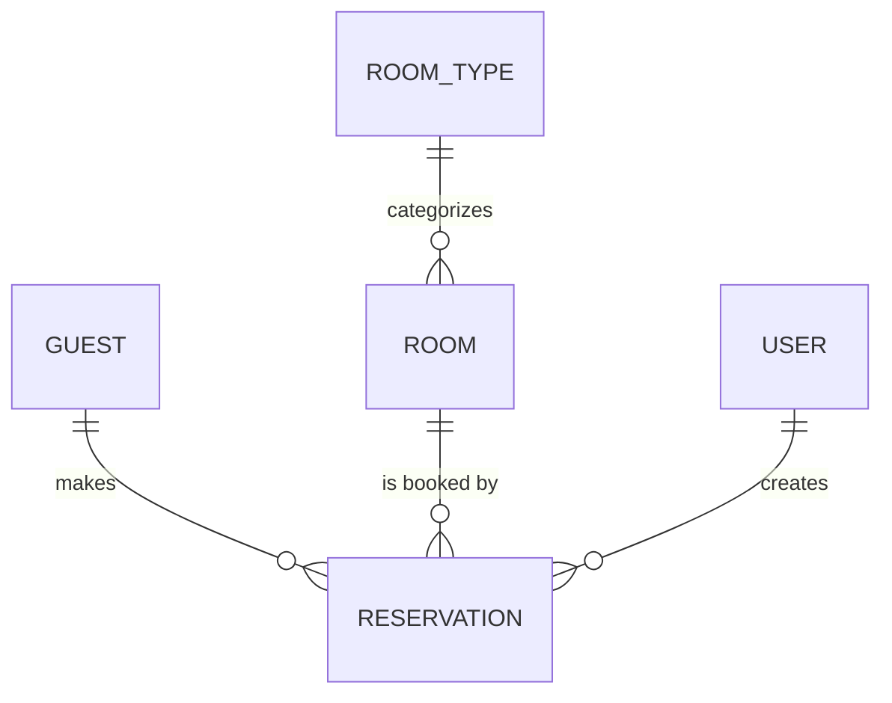

# Entity Model

Entity model for the Hotel Reservation System (HRS), derived from [requirements.md](requirements.md).

## Entity Relationship Diagram

```mermaid
erDiagram
    ROOM_TYPE ||--o{ ROOM : "categorizes"
    GUEST ||--o{ RESERVATION : "makes"
    ROOM ||--o{ RESERVATION : "is booked by"
    USER ||--o{ RESERVATION : "creates"
```

### ROOM_TYPE

Defines a category of rooms sharing the same capacity and nightly price.

| Attribute   | Description                     | Data Type | Length/Precision | Validation Rules              |
|-------------|---------------------------------|-----------|------------------|-------------------------------|
| id          | Unique identifier               | Long      | 19               | Primary Key, Sequence         |
| name        | Name of the room type           | String    | 50               | Not Null, Unique              |
| description | Description shown to guests     | String    | 500              | Optional                      |
| capacity    | Maximum number of guests        | Integer   | 10               | Not Null, Min: 1, Max: 10     |
| price       | Price per night in CHF          | Decimal   | 10,2             | Not Null, Min: 0, Max: 10000  |

### ROOM

One of the ten physical rooms of the hotel together with its housekeeping state.

| Attribute            | Description                                   | Data Type | Length/Precision | Validation Rules                                    |
|----------------------|-----------------------------------------------|-----------|------------------|-----------------------------------------------------|
| id                   | Unique identifier                             | Long      | 19               | Primary Key, Sequence                               |
| room_number          | Number displayed on the door                  | Integer   | 10               | Not Null, Unique                                    |
| room_type_id         | Category of the room                          | Long      | 19               | Not Null, Foreign Key (ROOM_TYPE.id)                |
| cleaning_status      | Housekeeping state of the room                | String    | 20               | Not Null, Values: Clean, Dirty, Out Of Service      |
| out_of_service_note  | Reason the room is out of service             | String    | 500              | Optional                                            |

**Constraints:** The out-of-service note must be present when the cleaning status is Out Of Service.

### GUEST

A person who stays at the hotel and whose contact details are kept for future bookings.

| Attribute   | Description                  | Data Type | Length/Precision | Validation Rules       |
|-------------|------------------------------|-----------|------------------|------------------------|
| id          | Unique identifier            | Long      | 19               | Primary Key, Sequence  |
| first_name  | Given name                   | String    | 100              | Not Null               |
| last_name   | Family name                  | String    | 100              | Not Null               |
| email       | Email address for confirmations | String | 255              | Not Null, Format: Email |
| phone       | Phone number                 | String    | 30               | Optional               |
| street      | Street and house number      | String    | 200              | Optional               |
| postal_code | Postal code                  | String    | 20               | Optional               |
| city        | City                         | String    | 100              | Optional               |
| country     | Country                      | String    | 100              | Optional               |

### RESERVATION

A booking of one room for one guest over a date range, including its check-in and check-out state.

| Attribute          | Description                                     | Data Type | Length/Precision | Validation Rules                                                   |
|--------------------|-------------------------------------------------|-----------|------------------|--------------------------------------------------------------------|
| id                 | Unique identifier                               | Long      | 19               | Primary Key, Sequence                                              |
| reservation_number | Number communicated to the guest                | String    | 20               | Not Null, Unique                                                   |
| guest_id           | Guest who made the reservation                  | Long      | 19               | Not Null, Foreign Key (GUEST.id)                                   |
| room_id            | Room that is booked                             | Long      | 19               | Not Null, Foreign Key (ROOM.id)                                    |
| created_by_user_id | Staff user who created the reservation on site  | Long      | 19               | Optional                                                           |
| arrival_date       | First night of the stay                         | Date      | -                | Not Null                                                           |
| departure_date     | Day the guest leaves                            | Date      | -                | Not Null                                                           |
| number_of_guests   | Number of persons staying                       | Integer   | 10               | Not Null, Min: 1, Max: 10                                          |
| total_price        | Total price of the stay in CHF                  | Decimal   | 10,2             | Not Null, Min: 0, Max: 1000000                                     |
| source             | Channel through which the booking was made      | String    | 20               | Not Null, Values: Online, On Site                                  |
| status             | Lifecycle state of the reservation              | String    | 20               | Not Null, Values: Confirmed, Checked In, Checked Out, Cancelled    |
| created_at         | Time the reservation was created                | DateTime  | -                | Not Null                                                           |
| checked_in_at      | Time the guest was checked in                   | DateTime  | -                | Optional                                                           |
| checked_out_at     | Time the guest was checked out                  | DateTime  | -                | Optional                                                           |

**Constraints:** Departure date must be after arrival date. Number of guests must not exceed the capacity of the room's room type. Two reservations with status other than Cancelled must not overlap in date range for the same room. Created-by user is required when the source is On Site and must reference USER.id. Checked-in time is required when status is Checked In or Checked Out. Checked-out time is required when status is Checked Out.

### USER

A staff account that can log in to the management functions of the system.

| Attribute     | Description                        | Data Type | Length/Precision | Validation Rules                                       |
|---------------|------------------------------------|-----------|------------------|--------------------------------------------------------|
| id            | Unique identifier                  | Long      | 19               | Primary Key, Sequence                                  |
| username      | Login name                         | String    | 50               | Not Null, Unique                                       |
| password_hash | Bcrypt hash of the password        | String    | 100              | Not Null                                               |
| first_name    | Given name                         | String    | 100              | Not Null                                               |
| last_name     | Family name                        | String    | 100              | Not Null                                               |
| role          | Role that determines view access   | String    | 20               | Not Null, Values: Receptionist, Manager, Housekeeping  |
| active        | Whether the account may log in     | Boolean   | 1                | Not Null                                               |
